# 명지역량통합관리시스템 중간보고서

**프로젝트명:** MJU Career Matching System (명지역량통합관리시스템)
**개발 기간:** 2024년 10월 ~ 현재 진행 중
**개발 인원:** 백엔드/프론트엔드 통합 개발
**보고서 작성일:** 2026년 2월 12일

---

## 목차

1. [프로젝트 개요](#1-프로젝트-개요)
2. [시스템 아키텍처](#2-시스템-아키텍처)
3. [주요 기능](#3-주요-기능)
4. [데이터베이스 설계](#4-데이터베이스-설계)
5. [핵심 알고리즘](#5-핵심-알고리즘)
6. [현재 진행 상황](#6-현재-진행-상황)
7. [향후 계획](#7-향후-계획)
8. [부록](#8-부록)

---

## 1. 프로젝트 개요

### 1.1 배경 및 필요성

현대 대학생들은 진로 선택과 전공 탐색에 있어 다음과 같은 어려움을 겪고 있습니다:

- **정보 부족**: 자신의 성격 유형과 적합한 전공에 대한 체계적인 정보 부족
- **단편적 상담**: 기존 진로 상담은 수기 기반이며 개인별 데이터 누적이 어려움
- **연계 부족**: 성격검사, 역량진단, 전공탐색, 교육과정 설계가 서로 분리되어 있음
- **추적 불가**: 학생의 진로 개발 과정을 시계열로 추적하고 피드백하기 어려움

특히 명지대학교는 다양한 단과대학과 100개 이상의 전공을 운영하고 있어, 신입생과 재학생이 자신에게 최적화된 전공과 진로를 탐색하는 데 많은 시간과 노력이 소요됩니다. 이에 따라 **데이터 기반의 통합 진로관리 플랫폼**이 필요하게 되었습니다.

### 1.2 프로젝트 목적

본 프로젝트는 다음과 같은 목적을 달성하기 위해 개발되었습니다:

1. **과학적 성격 분석**: Holland의 RIASEC 모델 기반 성격 유형 진단
2. **AI 기반 전공 추천**: 코사인 유사도 알고리즘을 활용한 개인 맞춤형 전공 매칭
3. **역량 기반 학습 설계**: 핵심역량 진단을 통한 체계적인 교육과정 설계 지원
4. **롤모델 제시**: 졸업생 취업 데이터를 활용한 현실적인 진로 경로 제공
5. **통합 대시보드**: 5단계 진로설계 프로세스를 하나의 플랫폼에서 관리

### 1.3 프로젝트 의의

- **명지대 최초**: 성격검사부터 교육과정 설계까지 통합한 진로관리 시스템
- **데이터 기반 의사결정**: 감에 의존하던 진로 상담을 정량적 데이터로 전환
- **학생 중심 설계**: 복잡한 관리자 기능보다 학생의 UX를 최우선으로 설계
- **확장 가능성**: 모듈화된 구조로 향후 타 대학 및 교육기관 적용 가능

---

## 2. 시스템 아키텍처

### 2.1 기술 스택

#### 프론트엔드
| 기술 | 버전 | 용도 |
|------|------|------|
| **React** | 18.2.0 | UI 컴포넌트 기반 SPA 개발 |
| **TypeScript** | 5.6.2 | 타입 안정성 확보 및 개발 생산성 향상 |
| **Vite** | 5.4.10 | 빠른 개발 서버 및 번들링 |
| **Tailwind CSS** | 3.4.14 | 유틸리티 기반 스타일링 |
| **Recharts** | 2.10.3 | RIASEC/역량 데이터 시각화 (레이더 차트) |
| **Framer Motion** | 11.2.6 | 페이지 전환 및 애니메이션 |
| **html2canvas** | 1.4.1 | 검사 결과 PDF 저장 기능 |

#### 백엔드 및 데이터베이스
| 기술 | 용도 |
|------|------|
| **Supabase** | PostgreSQL 기반 BaaS (Backend as a Service) |
| **Supabase Auth** | 학생 인증 및 세션 관리 |
| **Supabase Storage** | 추후 이미지/파일 업로드 지원 예정 |
| **Row Level Security (RLS)** | 학생별 데이터 격리 및 보안 |

#### 배포 및 인프라
| 기술 | 용도 |
|------|------|
| **Vercel** | 자동 배포 및 CDN 호스팅 |
| **GitHub** | 소스코드 버전 관리 |
| **Playwright** | E2E 테스트 (진행 중) |

### 2.2 시스템 구조도

```
┌─────────────────┐
│   사용자 Browser  │
│  (Chrome/Safari) │
└────────┬────────┘
         │ HTTPS
         ▼
┌─────────────────┐
│  Vercel CDN     │
│  (정적 호스팅)   │
└────────┬────────┘
         │
         ▼
┌─────────────────────────────────────────┐
│         React SPA (Vite)                │
│  ┌───────────────────────────────────┐  │
│  │  App.tsx (라우팅 & 상태 관리)    │  │
│  ├───────────────────────────────────┤  │
│  │  Pages/                           │  │
│  │  - Dashboard                       │  │
│  │  - PilotSurvey (RIASEC)           │  │
│  │  - CompetencySurvey               │  │
│  │  - MajorExplorer                  │  │
│  │  - CareerRoadmapPage              │  │
│  │  - AdminDashboard                 │  │
│  ├───────────────────────────────────┤  │
│  │  Utils/                           │  │
│  │  - recommendMajors.ts (AI 매칭)  │  │
│  │  - cosineSimilarity (알고리즘)   │  │
│  └───────────────────────────────────┘  │
└────────┬────────────────────────────────┘
         │ REST API
         │ (Supabase Client SDK)
         ▼
┌─────────────────────────────────────────┐
│       Supabase (PostgreSQL)             │
│  ┌───────────────────────────────────┐  │
│  │  Database Tables:                 │  │
│  │  - students (학생 정보)          │  │
│  │  - pilot_results (RIASEC 결과)   │  │
│  │  - competency_results (역량진단) │  │
│  │  - graduates (졸업생 데이터)      │  │
│  │  - major_courses (전공 과목)      │  │
│  └───────────────────────────────────┘  │
│  ┌───────────────────────────────────┐  │
│  │  Auth (인증)                      │  │
│  │  - JWT 기반 세션 관리             │  │
│  │  - Row Level Security (RLS)       │  │
│  └───────────────────────────────────┘  │
└─────────────────────────────────────────┘
```

### 2.3 프로젝트 구조

```
hsmatching/
├── src/
│   ├── App.tsx                    # 메인 애플리케이션 (라우팅, 인증, 상태)
│   ├── main.tsx                   # React 진입점
│   ├── pages/                     # 페이지 컴포넌트 (21개)
│   │   ├── Dashboard.tsx          # 학생 대시보드
│   │   ├── PilotSurvey.tsx        # RIASEC 검사
│   │   ├── PilotResultPage.tsx    # RIASEC 결과
│   │   ├── CompetencySurvey.tsx   # 핵심역량진단
│   │   ├── CareerInsight.tsx      # 진로 인사이트
│   │   ├── MajorExplorer.tsx      # 전공 탐색기
│   │   ├── CareerRoadmapPage.tsx  # 종합 진로 로드맵
│   │   ├── StepBridgePage.tsx     # 단계 전환 브릿지
│   │   └── AdminDashboard.tsx     # 관리자 대시보드
│   ├── components/                # 재사용 컴포넌트 (16개)
│   │   ├── Login.tsx              # 로그인
│   │   ├── Layout.tsx             # 공통 레이아웃
│   │   ├── LockedPageOverlay.tsx  # 페이지 잠금 오버레이
│   │   ├── RadarChart.tsx         # 레이더 차트
│   │   └── ProgressTracker.tsx    # 진행 상황 트래커
│   ├── utils/                     # 유틸리티 함수 (9개)
│   │   ├── recommendMajors.ts     # 전공 추천 알고리즘 (329줄)
│   │   ├── cosineSimilarity.ts    # 코사인 유사도 계산
│   │   └── pdfExport.ts           # PDF 저장 기능
│   ├── data/                      # 정적 데이터 (18개)
│   │   ├── majorList.ts           # 100+ 전공 데이터 (RIASEC 벡터)
│   │   ├── questionPool.ts        # RIASEC 문항 (42개)
│   │   ├── competencyQuestions.ts # 역량진단 문항 (36개)
│   │   └── stepBridgeContent.ts   # 브릿지 페이지 콘텐츠
│   ├── types/                     # TypeScript 타입 정의 (6개)
│   │   ├── pilot.ts
│   │   ├── admin.ts
│   │   └── student.ts
│   └── hooks/                     # 커스텀 훅 (3개)
│       └── useStudentData.ts
├── lib/
│   └── supabase.ts                # Supabase 클라이언트 및 쿼리
├── public/                        # 정적 파일
├── screenshots/                   # 시스템 스크린샷 (향후 추가 예정)
├── package.json
├── vite.config.ts
├── tailwind.config.js
└── tsconfig.json

총 71개 TypeScript/React 파일, 약 52,868 줄의 코드
```

---

## 3. 주요 기능

본 시스템은 **5단계 진로설계 프로세스**를 따릅니다.

### 3.1 랜딩 페이지 및 인증

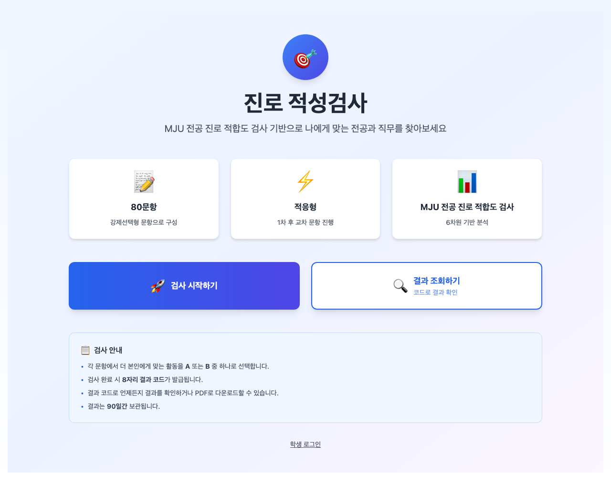
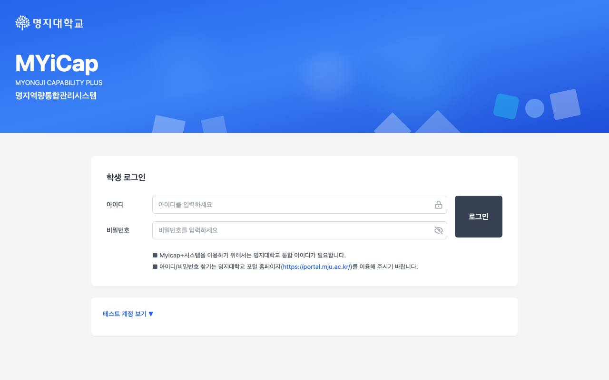

#### 기능 설명
- **공개 랜딩 페이지**: 비로그인 사용자도 시스템 소개 및 검사 체험 가능
- **학생 로그인**: 학번 + 비밀번호 기반 인증 (Supabase Auth 연동)
- **관리자 로그인**: 역할 기반 접근 제어 (RBAC) 지원
- **자동 세션 복원**: `localStorage` 기반 세션 유지로 새로고침 시에도 로그인 상태 유지

#### 기술적 특징
```typescript
// localStorage 기반 인증 상태 복원
useEffect(() => {
  const savedIsLoggedIn = localStorage.getItem('auth_isLoggedIn') === 'true';
  const savedStudentId = localStorage.getItem('auth_studentId');
  if (savedIsLoggedIn && savedStudentId) {
    setIsLoggedIn(true);
    setCurrentStudentId(savedStudentId);
  }
}, []);
```

---

### 3.2 Step 1: 자기이해 - RIASEC 성격검사

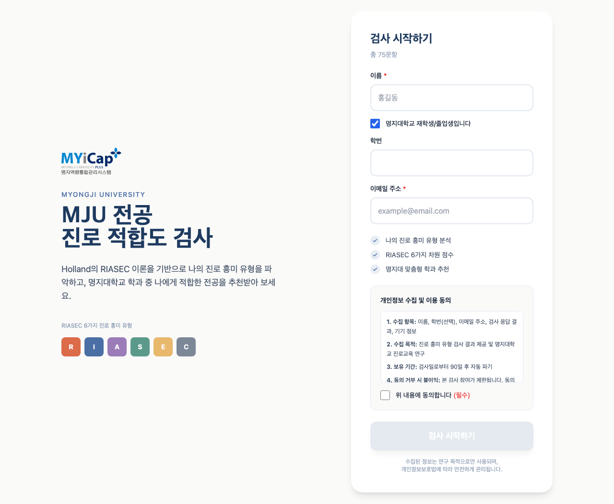
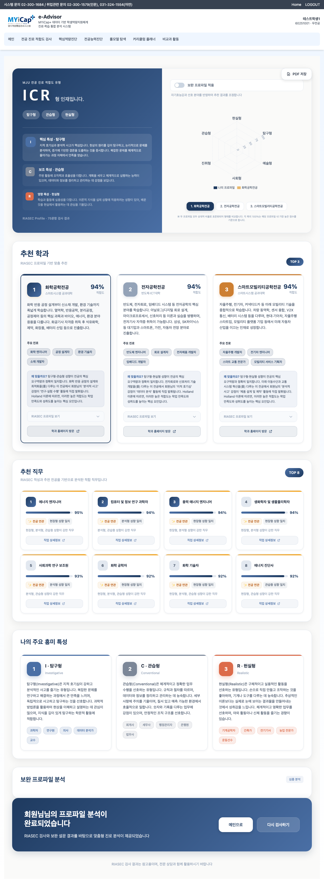

#### 기능 설명
- **Holland의 RIASEC 모델**: 6가지 성격 유형 (현장형, 탐구형, 예술형, 사회형, 진취형, 사무형)
- **42개 문항**: 각 유형별 7문항, 5점 척도 (전혀 그렇지 않다 ~ 매우 그렇다)
- **실시간 진행률 표시**: Progress bar로 현재 진행 상황 시각화
- **보완검사**: RIASEC 검사 후 가치관 검사 추가 (선택 사항)

#### RIASEC 6차원 설명
| 차원 | 영문 | 설명 | 대표 전공 |
|------|------|------|-----------|
| **R** | Realistic | 현장형 - 기계/도구 다루기 선호 | 기계공학, 건축학, 체육학 |
| **I** | Investigative | 탐구형 - 분석/연구 활동 선호 | 생명과학, 화학, 수학 |
| **A** | Artistic | 예술형 - 창작/표현 활동 선호 | 시각디자인, 음악학, 영상학 |
| **S** | Social | 사회형 - 사람 돕기/교육 선호 | 사회복지학, 교육학, 상담학 |
| **E** | Enterprising | 진취형 - 설득/경영 활동 선호 | 경영학, 광고홍보학, 법학 |
| **C** | Conventional | 사무형 - 정리/문서 업무 선호 | 회계학, 경제학, 행정학 |

#### 결과 시각화
- **레이더 차트**: Recharts 라이브러리를 활용한 6차원 시각화
- **성격 코드**: 상위 3개 유형 조합 (예: RIE, ASE 등)
- **추천 전공**: 코사인 유사도 기반 상위 5개 전공 제시
- **PDF 저장**: `html2canvas` + `jspdf`를 활용한 결과 저장 기능

```typescript
// RIASEC 점수 계산 로직 (PilotSurvey.tsx)
const calculateRiasecScores = (responses: Record<string, number>) => {
  const scores = { R: 0, I: 0, A: 0, S: 0, E: 0, C: 0 };
  questions.forEach((q, idx) => {
    const response = responses[`q${idx}`] || 3; // 기본값 3 (보통)
    scores[q.dimension] += response - 1; // 1~5 → 0~4로 변환
  });
  return scores;
};
```

---

### 3.3 Step 2: 핵심역량진단

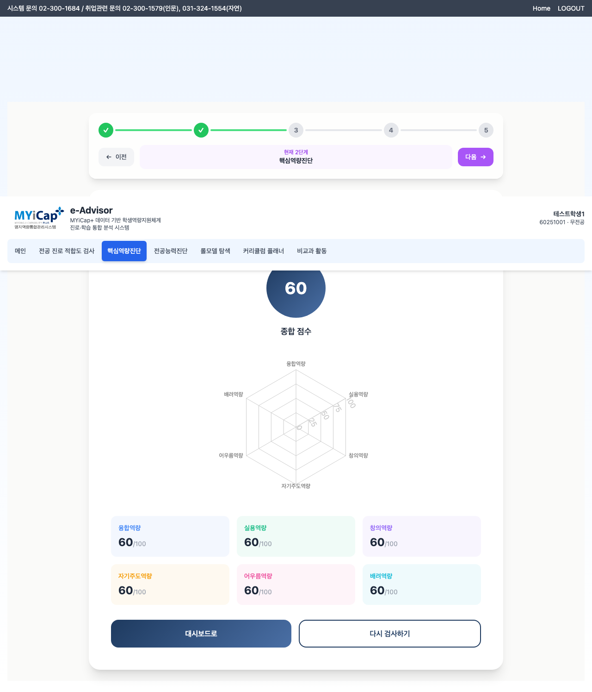

#### 기능 설명
- **6대 핵심역량**: 명지대학교 인재상에 기반한 역량 모델
- **36개 문항**: 각 역량별 6문항, 5점 척도
- **레이더 차트 시각화**: RIASEC과 동일한 방식으로 시각화
- **전공 추천 연계**: 역량 점수를 전공 매칭에 반영 (30% 가중치)

#### 6대 핵심역량
| 역량 | 설명 | 세부 요소 |
|------|------|-----------|
| **창의융합** | 창의적 문제해결 능력 | 창의력, 융합적 사고, 혁신 |
| **글로벌소통** | 국제적 의사소통 능력 | 외국어, 문화이해, 협업 |
| **자기계발** | 자기주도 학습 능력 | 목표설정, 시간관리, 성찰 |
| **전공역량** | 전공 분야 전문성 | 이론, 실무, 응용 |
| **정보활용** | 디지털 리터러시 | 정보검색, 데이터 분석, SW 활용 |
| **공동체** | 사회적 책임과 윤리 | 배려, 봉사, 윤리의식 |

#### 역량 연계 알고리즘
```typescript
// recommendMajors.ts - 역량 점수를 전공 매칭에 반영
const clusterBonus = clusterScores
  ? userClusterScore >= 0.7 ? 0.15  // 높은 일치
  : userClusterScore >= 0.4 ? 0.08  // 중간 일치
  : 0.05                             // 인접 계열
  : 0;

const rawScore = baseCos * 0.45 + synergy * 0.25 + clusterBonus * 2;
```

---

### 3.4 Step 3: 전공탐색

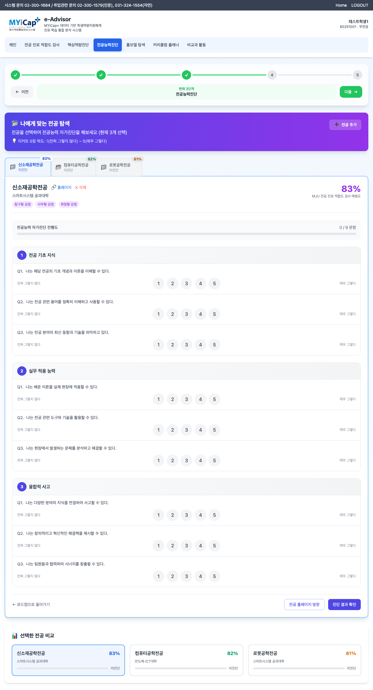
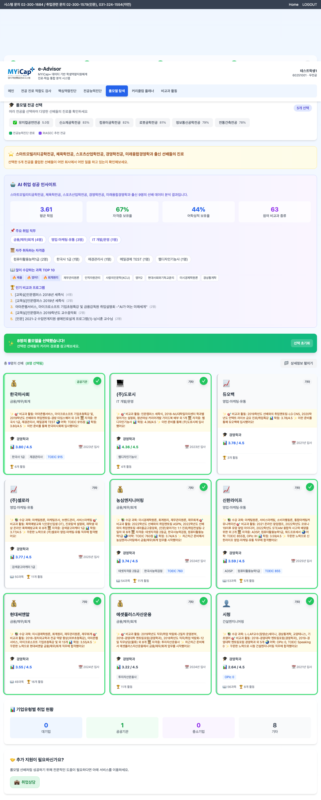

#### 기능 설명
- **AI 기반 전공 추천**: 코사인 유사도 알고리즘으로 상위 5~10개 전공 추천
- **전공 비교**: 최대 3개 전공의 RIASEC 프로필을 레이더 차트로 동시 비교
- **졸업생 롤모델**: 각 전공 졸업생의 실제 취업 사례 제시
  - 회사명, 직무, 산업 분야
  - 재학 중 이수 과목 및 비교과 활동
- **전공 상세 정보**: 전공 홈페이지 링크, 교육과정 정보 제공

#### 전공 탐색 UI
- **추천 전공 카드**: 매칭 점수 + 전공명 + 간단한 설명
- **상세 모달**: 전공 클릭 시 RIASEC 벡터, 교육과정, 진로 경로 표시
- **롤모델 필터링**: 산업군별, 직무별 필터 지원

```typescript
// 졸업생 롤모델 데이터 구조
interface Graduate {
  id: string;
  name: string;
  major: string;
  company: string;
  job_title: string;
  industry: string;
  graduation_year: number;
  courses_taken: string[];  // 이수 과목
  extracurricular: string[]; // 비교과 활동
}
```

---

### 3.5 Step 4: 커리큘럼 설계

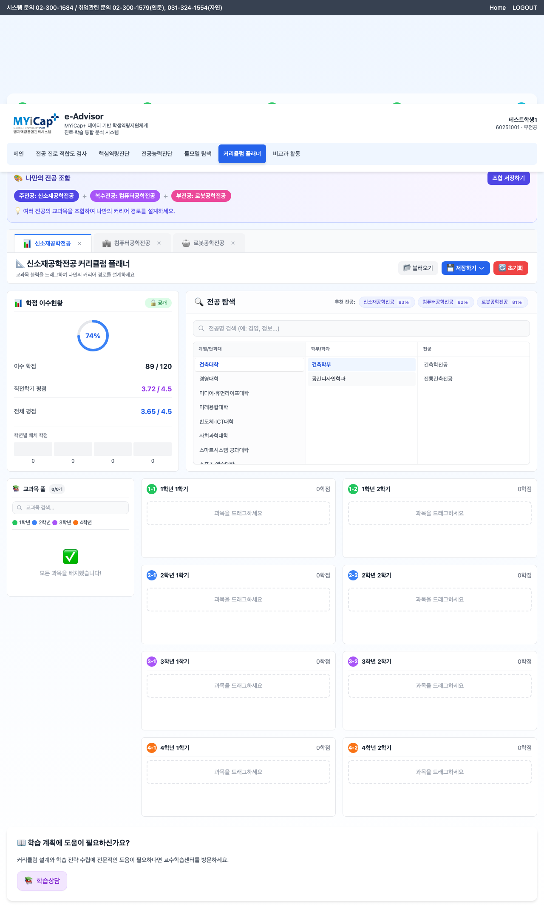

#### 기능 설명
- **학기별 교육과정 계획**: 8학기 동안의 수강 계획 수립
- **전공 이수 체크**: 전공필수/전공선택 학점 자동 계산
- **교양 밸런싱**: 교양 영역별 이수 현황 시각화
- **드래그 앤 드롭**: 과목을 학기별로 쉽게 배치 (향후 구현 예정)
- **저장 및 불러오기**: 작성한 계획을 DB에 저장

#### 커리큘럼 플래너 데이터 모델
```typescript
interface CurriculumPlan {
  student_id: string;
  major: string;
  semesters: {
    semester: number;  // 1~8
    courses: {
      code: string;
      name: string;
      credits: number;
      type: 'major_required' | 'major_elective' | 'general';
    }[];
  }[];
  total_credits: number;
  major_credits: number;
  general_credits: number;
}
```

---

### 3.6 Step 5: 종합 대시보드

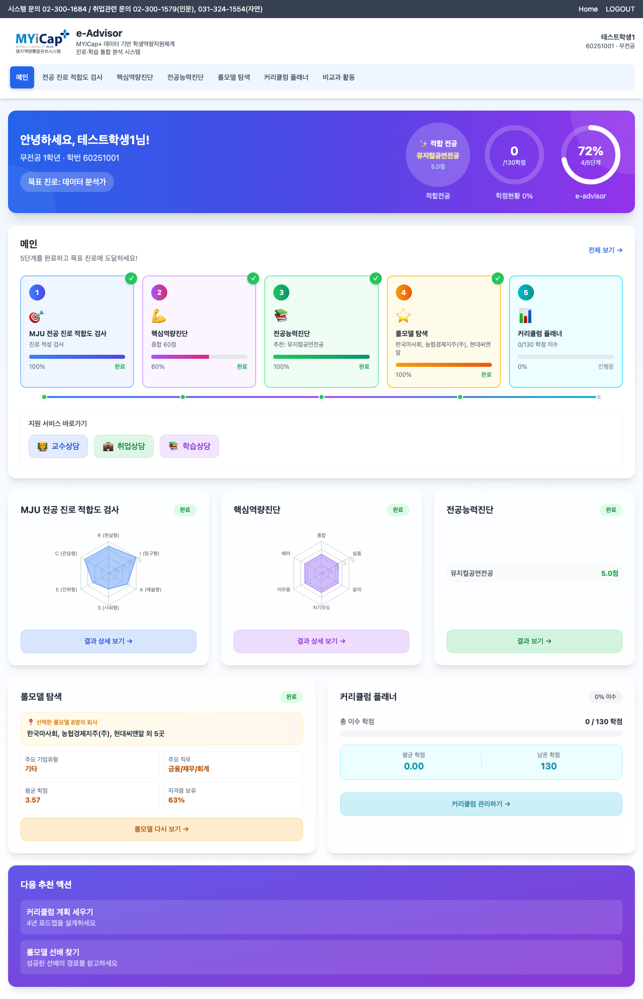

#### 기능 설명
- **5단계 진행률 트래커**: 각 단계별 완료 여부를 시각적으로 표시
- **RIASEC 프로필 요약**: 나의 성격 코드 및 강점 영역 한눈에 보기
- **추천 전공 요약**: 상위 3개 전공 매칭 점수와 함께 표시
- **다음 단계 안내**: 미완료된 첫 번째 단계로 바로가기 버튼 제공
- **최근 활동**: 최근 완료한 검사 및 계획 히스토리

#### 대시보드 구성 요소
1. **프로그레스 바**: 5단계 중 현재 위치 표시
2. **나의 프로필**: RIASEC 코드, 핵심역량 상위 3개
3. **추천 전공**: 매칭 점수 순으로 상위 3개 카드
4. **롤모델**: 관심 전공의 졸업생 사례 2~3개
5. **빠른 시작**: 미완료 단계로 이동하는 CTA 버튼

```typescript
// Dashboard.tsx - 단계 완료 상태 체크
const stepStatus = {
  step1Complete: !!riasecResult,
  step2Complete: !!competencyResult,
  step3Complete: majorAssessments.length > 0,
  step4Complete: hasRoleModelSelection,
  step5Complete: hasCurriculumPlan
};
```

---

### 3.7 학사 정보 조회

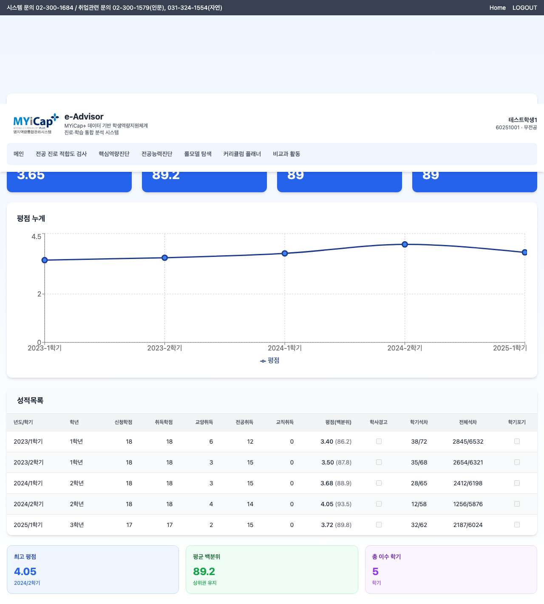
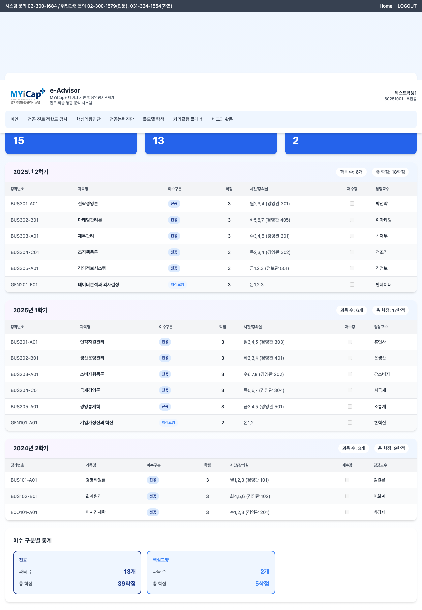

#### 기능 설명
- **성적 조회**: 학기별 성적 및 평점 확인
- **수강 내역**: 이수한 과목 목록 및 학점 합계
- **학점 통계**: 전공/교양 학점 분포 시각화
- **졸업 요건 체크**: 남은 이수 학점 자동 계산

---

### 3.8 관리자 대시보드

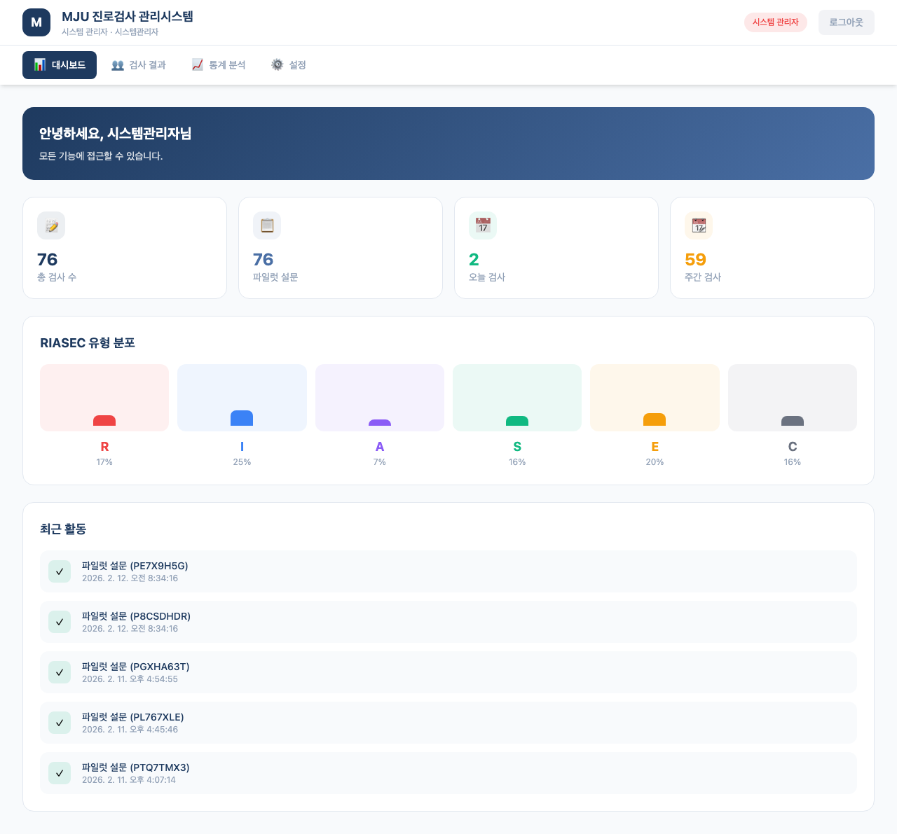

#### 기능 설명
- **학생 검사 현황**: 전체 학생의 RIASEC/역량 검사 완료율
- **접속 로그**: 일별/주별 접속 통계
- **데이터 다운로드**: Excel 형식으로 검사 결과 일괄 다운로드
- **공지사항 관리**: 시스템 공지 등록 및 수정
- **역할 기반 접근 제어**: Admin, Staff, Viewer 권한 구분

#### 관리자 통계 대시보드
```typescript
interface AdminStats {
  total_students: number;
  completed_riasec: number;
  completed_competency: number;
  completion_rate: number;
  daily_active_users: number;
  most_popular_major: string;
}
```

---

## 4. 데이터베이스 설계

### 4.1 ER 다이어그램

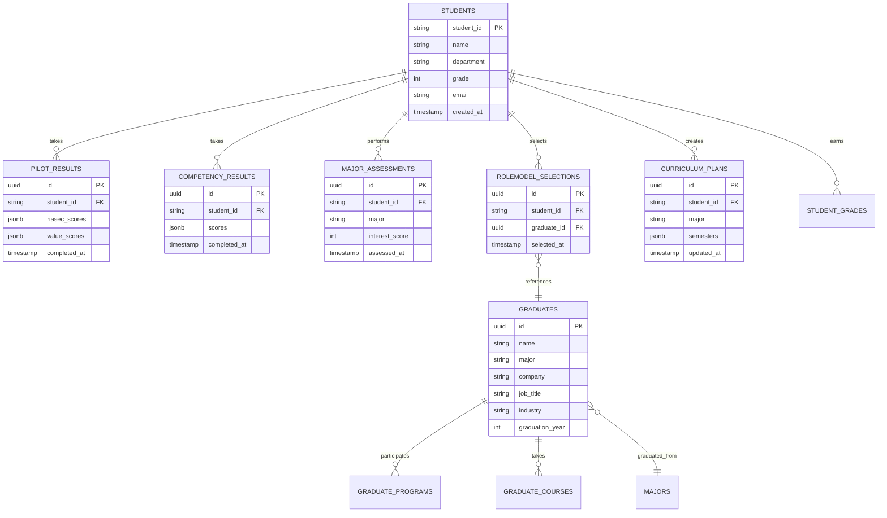

### 4.2 주요 테이블 설명

#### 1) `students` - 학생 정보
| 컬럼명 | 타입 | 제약 | 설명 |
|--------|------|------|------|
| student_id | VARCHAR(20) | PK | 학번 (예: 60211234) |
| name | VARCHAR(50) | NOT NULL | 이름 |
| department | VARCHAR(100) | | 소속 학과 |
| grade | INTEGER | | 학년 (1~4) |
| email | VARCHAR(100) | UNIQUE | 이메일 |
| created_at | TIMESTAMP | DEFAULT NOW() | 가입일시 |

#### 2) `pilot_results` - RIASEC 검사 결과
| 컬럼명 | 타입 | 제약 | 설명 |
|--------|------|------|------|
| id | UUID | PK | 고유 ID |
| student_id | VARCHAR(20) | FK | 학번 (students 참조) |
| riasec_scores | JSONB | NOT NULL | `{"R": 24, "I": 18, ...}` |
| value_scores | JSONB | | 가치관 검사 점수 (선택) |
| skipped_supplementary | BOOLEAN | DEFAULT FALSE | 보완검사 건너뜀 여부 |
| completed_at | TIMESTAMP | DEFAULT NOW() | 완료일시 |

**JSONB 예시:**
```json
{
  "R": 24,
  "I": 18,
  "A": 12,
  "S": 20,
  "E": 16,
  "C": 14
}
```

#### 3) `competency_results` - 핵심역량진단 결과
| 컬럼명 | 타입 | 제약 | 설명 |
|--------|------|------|------|
| id | UUID | PK | 고유 ID |
| student_id | VARCHAR(20) | FK | 학번 |
| scores | JSONB | NOT NULL | 6대 역량 점수 |
| completed_at | TIMESTAMP | DEFAULT NOW() | 완료일시 |

**JSONB 예시:**
```json
{
  "창의융합": 4.2,
  "글로벌소통": 3.8,
  "자기계발": 4.5,
  "전공역량": 3.6,
  "정보활용": 4.0,
  "공동체": 3.9
}
```

#### 4) `major_assessments` - 전공능력진단
| 컬럼명 | 타입 | 제약 | 설명 |
|--------|------|------|------|
| id | UUID | PK | 고유 ID |
| student_id | VARCHAR(20) | FK | 학번 |
| major | VARCHAR(100) | NOT NULL | 전공명 |
| interest_score | INTEGER | 1~5 | 관심도 (1~5점) |
| assessed_at | TIMESTAMP | DEFAULT NOW() | 평가일시 |

#### 5) `graduates` - 졸업생 취업 정보
| 컬럼명 | 타입 | 제약 | 설명 |
|--------|------|------|------|
| id | UUID | PK | 고유 ID |
| name | VARCHAR(50) | | 이름 (익명화 가능) |
| major | VARCHAR(100) | NOT NULL | 전공 |
| company | VARCHAR(100) | | 취업 회사 |
| job_title | VARCHAR(100) | | 직무/직책 |
| industry | VARCHAR(100) | | 산업 분야 |
| graduation_year | INTEGER | | 졸업년도 |

#### 6) `graduate_courses` - 졸업생 수강 내역
| 컬럼명 | 타입 | 제약 | 설명 |
|--------|------|------|------|
| id | UUID | PK | 고유 ID |
| graduate_id | UUID | FK | 졸업생 ID |
| course_code | VARCHAR(20) | | 과목코드 |
| course_name | VARCHAR(100) | | 과목명 |
| semester | VARCHAR(10) | | 수강학기 (예: 2021-1) |

#### 7) `rolemodel_selections` - 롤모델 선택
| 컬럼명 | 타입 | 제약 | 설명 |
|--------|------|------|------|
| id | UUID | PK | 고유 ID |
| student_id | VARCHAR(20) | FK | 학번 |
| graduate_id | UUID | FK | 졸업생 ID |
| selected_at | TIMESTAMP | DEFAULT NOW() | 선택일시 |

#### 8) `curriculum_plans` - 교육과정 계획
| 컬럼명 | 타입 | 제약 | 설명 |
|--------|------|------|------|
| id | UUID | PK | 고유 ID |
| student_id | VARCHAR(20) | FK | 학번 |
| major | VARCHAR(100) | | 계획 전공 |
| semesters | JSONB | NOT NULL | 학기별 수강 계획 |
| total_credits | INTEGER | | 총 학점 |
| updated_at | TIMESTAMP | DEFAULT NOW() | 수정일시 |

**JSONB 예시:**
```json
{
  "semesters": [
    {
      "semester": 1,
      "courses": [
        {"code": "GEB001", "name": "사고와표현", "credits": 3, "type": "general"},
        {"code": "ICE101", "name": "컴퓨터공학입문", "credits": 3, "type": "major_required"}
      ]
    },
    ...
  ]
}
```

#### 9) `admin_users` - 관리자 계정
| 컬럼명 | 타입 | 제약 | 설명 |
|--------|------|------|------|
| id | UUID | PK | 고유 ID |
| username | VARCHAR(50) | UNIQUE | 관리자 ID |
| name | VARCHAR(50) | | 이름 |
| role | VARCHAR(20) | NOT NULL | admin/staff/viewer |
| created_at | TIMESTAMP | DEFAULT NOW() | 생성일시 |

### 4.3 Row Level Security (RLS) 정책

Supabase의 RLS를 활용하여 학생별 데이터 격리:

```sql
-- 학생은 자신의 결과만 조회 가능
CREATE POLICY "Students can view own results"
ON pilot_results
FOR SELECT
USING (auth.uid() = student_id);

-- 관리자는 모든 결과 조회 가능
CREATE POLICY "Admins can view all results"
ON pilot_results
FOR SELECT
TO authenticated
USING (
  EXISTS (
    SELECT 1 FROM admin_users
    WHERE username = current_user
    AND role IN ('admin', 'staff')
  )
);
```

---

## 5. 핵심 알고리즘

### 5.1 RIASEC 성격 유형 검사

#### 이론적 배경
Holland의 RIASEC 모델은 직업 심리학에서 가장 널리 사용되는 성격-진로 이론으로, 개인의 성격 유형과 직업 환경 간의 적합도를 측정합니다. 6가지 성격 유형은 육각형 모델로 배치되며, 인접한 유형은 높은 상관관계를 가집니다.

#### 점수 계산 알고리즘

**1단계: 문항별 응답 수집**
- 42개 문항 (각 차원당 7문항)
- 5점 리커트 척도 (1: 전혀 그렇지 않다 ~ 5: 매우 그렇다)

**2단계: 원점수 계산**
```typescript
const calculateRiasecScores = (responses: Record<string, number>) => {
  const scores = { R: 0, I: 0, A: 0, S: 0, E: 0, C: 0 };

  questions.forEach((q, idx) => {
    const response = responses[`q${idx}`] || 3; // 기본값 3 (보통)
    scores[q.dimension] += response - 1; // 1~5 → 0~4로 변환
  });

  // 각 차원당 7문항 × 4점 = 최대 28점
  return scores;
};
```

**3단계: 정규화 (0-1 범위)**
```typescript
const normalizedResult = {
  R: scores.R / Math.max(...Object.values(scores)),
  I: scores.I / Math.max(...Object.values(scores)),
  A: scores.A / Math.max(...Object.values(scores)),
  S: scores.S / Math.max(...Object.values(scores)),
  E: scores.E / Math.max(...Object.values(scores)),
  C: scores.C / Math.max(...Object.values(scores)),
};
```

**4단계: 성격 코드 생성**
- 상위 3개 차원을 내림차순으로 조합
- 예: R=0.9, I=0.7, S=0.6 → **"RIS"**

---

### 5.2 코사인 유사도 기반 전공 매칭

#### 알고리즘 개요
사용자의 RIASEC 벡터와 각 전공의 이상적 RIASEC 벡터 간의 코사인 유사도를 계산하여 매칭 점수를 산출합니다.

#### 수학적 정의

**코사인 유사도:**
```
cos(θ) = (A · B) / (||A|| × ||B||)
```

여기서:
- A = 사용자 RIASEC 벡터 (R, I, A, S, E, C, V)
- B = 전공 RIASEC 벡터
- A · B = 내적 (dot product)
- ||A|| = 벡터 A의 크기 (magnitude)

#### 구현 코드

**1단계: 벡터 정규화**
```typescript
function prepareVector(source: RiasecResult): PreparedVector {
  const vector = {} as Record<Dim, number>;
  let sumSquares = 0;

  DIMS.forEach((dim) => {
    const value = clamp(source?.[dim]); // 0~1 범위로 제한
    vector[dim] = value;
    sumSquares += value * value;
  });

  const magnitude = Math.sqrt(sumSquares);
  const normalized = {} as Record<Dim, number>;

  DIMS.forEach((dim) => {
    normalized[dim] = vector[dim] / magnitude;
  });

  return { vector, normalized, magnitude };
}
```

**2단계: 코사인 유사도 계산**
```typescript
function cosineSimilarity(a: Record<Dim, number>, b: Record<Dim, number>) {
  let dot = 0;
  DIMS.forEach((dim) => {
    dot += a[dim] * b[dim]; // 내적 계산
  });
  return dot; // 이미 정규화되었으므로 크기로 나누지 않음
}
```

**3단계: 종합 매칭 점수 계산**
```typescript
const rawScore =
  baseCos * 0.45 +              // 기본 유사도 (45%)
  synergy * 0.25 +               // 상위 차원 시너지 (25%)
  clusterBonus * 2 +             // 계열 일치도 (최대 30%)
  diversityBonus -               // 다양성 보너스
  (shortagePenalty +             // 부족 페널티
   overloadPenalty +             // 과부하 페널티
   balancePenalty);              // 불균형 페널티

const normalizedScore = Math.max(0, Math.min(1, rawScore));
const matchScore = Math.round(normalizedScore * 100); // 0~100점
```

#### 점수 구성 요소 설명

| 요소 | 가중치 | 설명 |
|------|--------|------|
| **기본 코사인 유사도** | 45% | 전체적인 벡터 유사도 |
| **시너지 점수** | 25% | 상위 3개 차원의 일치도 |
| **계열 보너스** | 최대 30% | 역량진단 결과와 전공 계열 일치도 |
| **다양성 보너스** | +2% | 주요 차원이 충분히 높은 경우 |
| **부족 페널티** | -25% | 사용자 강점이 전공에 부족한 경우 |
| **과부하 페널티** | -40% | 사용자 약점이 전공에 과도한 경우 |
| **불균형 페널티** | -3% | 전체적인 프로필 불일치 |

#### 계열 일치도 보너스 (핵심역량 연계)

```typescript
let clusterBonus = 0;
if (clusterScores && major.cluster) {
  const userClusterScore = clusterScores[major.cluster] || 0;

  if (userClusterScore >= 0.7) {
    clusterBonus = 0.15;  // 높은 일치: 15% 보너스
  } else if (userClusterScore >= 0.4) {
    clusterBonus = 0.08;  // 중간 일치: 8% 보너스
  } else {
    // 인접 계열 체크 (예: 공학 ↔ 자연, 인문 ↔ 사회)
    const adjacentClusters = ADJACENT_CLUSTERS[major.cluster] || [];
    const hasAdjacentInterest = adjacentClusters.some(
      adj => (clusterScores[adj] || 0) >= 0.5
    );
    if (hasAdjacentInterest) {
      clusterBonus = 0.05; // 인접 계열: 5% 보너스
    }
  }
}
```

#### 전공 벡터 데이터 예시

```typescript
// majorList.ts
export const MAJORS = [
  {
    key: "computer_science",
    name: "컴퓨터공학과",
    cluster: "공학",
    vec: { R: 0.5, I: 0.9, A: 0.3, S: 0.2, E: 0.4, C: 0.6, V: 0.5 },
    college: "ICT융합대학",
    url: "https://cs.mju.ac.kr"
  },
  {
    key: "business_admin",
    name: "경영학과",
    cluster: "경상",
    vec: { R: 0.2, I: 0.5, A: 0.3, S: 0.7, E: 0.9, C: 0.8, V: 0.6 },
    college: "경영대학",
    url: "https://biz.mju.ac.kr"
  },
  // ... 100+ 전공
];
```

#### 다양성 확보 전략

동일한 성격 코드를 가진 전공이 여러 개일 경우, **시그니처 버킷팅**을 통해 다양성 확보:

```typescript
// 각 시그니처(예: "RI", "ES")별로 최고 점수 전공만 선택
const signatureBuckets = new Map<string, RecommendedMajor[]>();
scoredMajors.forEach((major) => {
  if (!signatureBuckets.has(major.signature)) {
    signatureBuckets.set(major.signature, []);
  }
  signatureBuckets.get(major.signature)!.push(major);
});

// 각 버킷의 대표 전공을 우선 추천
const bucketLeaders = Array.from(signatureBuckets.entries())
  .map(([signature, majors]) => ({
    signature,
    leader: majors[0] // 버킷 내 최고 점수
  }))
  .sort((a, b) => b.leader.matchScore - a.leader.matchScore);
```

---

### 5.3 핵심역량 분석

#### 역량 모델
명지대학교 6대 핵심역량:

| 영역 | 세부 요소 | 측정 문항 예시 |
|------|-----------|----------------|
| **창의융합** | 창의력, 융합사고, 혁신 | "나는 기존과 다른 새로운 아이디어를 제시할 수 있다" |
| **글로벌소통** | 외국어, 문화이해, 협업 | "나는 외국어로 의사소통하는 데 자신감이 있다" |
| **자기계발** | 목표설정, 시간관리, 성찰 | "나는 명확한 학습 목표를 설정하고 실천한다" |
| **전공역량** | 이론, 실무, 응용 | "나는 전공 분야의 핵심 개념을 잘 이해하고 있다" |
| **정보활용** | 정보검색, 데이터 분석, SW | "나는 필요한 정보를 효과적으로 찾고 활용할 수 있다" |
| **공동체** | 배려, 봉사, 윤리 | "나는 타인을 존중하고 배려하는 태도를 가지고 있다" |

#### 점수 계산
```typescript
// 각 역량별 6문항 평균
const competencyScores = {
  창의융합: avg(q1, q2, q3, q4, q5, q6),
  글로벌소통: avg(q7, q8, q9, q10, q11, q12),
  자기계발: avg(q13, q14, q15, q16, q17, q18),
  전공역량: avg(q19, q20, q21, q22, q23, q24),
  정보활용: avg(q25, q26, q27, q28, q29, q30),
  공동체: avg(q31, q32, q33, q34, q35, q36)
};
```

---

## 6. 현재 진행 상황

### 6.1 완료된 기능

#### 인증 및 사용자 관리
- [x] 학생 로그인 (학번 + 비밀번호)
- [x] 관리자 로그인 (역할 기반 접근 제어)
- [x] 세션 관리 (localStorage 기반 자동 복원)
- [x] 로그아웃 및 캐시 초기화

#### Step 1: 자기이해
- [x] RIASEC 42문항 검사
- [x] 보완검사 (가치관 검사)
- [x] 실시간 진행률 표시
- [x] 결과 저장 (DB + localStorage)
- [x] 결과 시각화 (레이더 차트)
- [x] PDF 저장 기능

#### Step 2: 핵심역량진단
- [x] 6대 역량 36문항 검사
- [x] 결과 저장 및 시각화
- [x] 전공 추천에 역량 점수 반영

#### Step 3: 전공탐색
- [x] 코사인 유사도 기반 전공 매칭 알고리즘
- [x] 상위 5~10개 전공 추천
- [x] 전공 비교 (레이더 차트)
- [x] 졸업생 롤모델 데이터베이스 설계
- [x] 롤모델 필터링 (산업군, 직무)

#### Step 4: 커리큘럼 설계
- [x] 학기별 교육과정 계획 UI
- [x] 전공 이수 학점 자동 계산
- [x] 교양 밸런싱 시각화
- [x] 계획 저장 및 불러오기

#### Step 5: 종합 대시보드
- [x] 5단계 진행률 트래커
- [x] RIASEC 프로필 요약
- [x] 추천 전공 요약 (상위 3개)
- [x] 다음 단계 안내
- [x] 최근 활동 히스토리

#### 관리자 기능
- [x] 학생 검사 현황 대시보드
- [x] 접속 로그 통계
- [x] 데이터 다운로드 (Excel)
- [x] 역할 기반 접근 제어 (Admin, Staff, Viewer)

#### 기술적 구현
- [x] React 18 + TypeScript 기반 SPA
- [x] Supabase 연동 (PostgreSQL + Auth)
- [x] Tailwind CSS 반응형 디자인
- [x] Recharts 데이터 시각화
- [x] Vercel 자동 배포
- [x] Row Level Security (RLS) 정책

### 6.2 진행 중인 기능

#### 데이터 확충
- [ ] 졸업생 롤모델 데이터 수집 (100명 → 500명 목표)
- [ ] 전공별 이수 과목 데이터 정제
- [ ] 비교과 활동 데이터베이스 구축

#### UI/UX 개선
- [ ] 커리큘럼 플래너 드래그 앤 드롭
- [ ] 모바일 반응형 최적화
- [ ] 다크 모드 지원
- [ ] 접근성 개선 (WCAG 2.1 AA 준수)

#### 성능 최적화
- [ ] 코드 스플리팅 (페이지별 lazy loading)
- [ ] 이미지 최적화 (WebP 변환)
- [ ] API 캐싱 전략 구현

#### 테스트
- [ ] E2E 테스트 (Playwright)
- [ ] 단위 테스트 (Jest + React Testing Library)
- [ ] 부하 테스트 (동시 접속 1000명)

---

## 7. 향후 계획

### 7.1 남은 작업

#### 단기 (1개월)
1. **졸업생 데이터 확충**
   - 취업지원팀 협업으로 최근 3년 졸업생 데이터 수집
   - 개인정보 익명화 처리
   - 산업군/직무 태깅 작업

2. **UI/UX 개선**
   - 사용자 피드백 수집 및 반영
   - 모바일 환경 테스트 및 최적화
   - 로딩 속도 개선

3. **테스트 및 안정화**
   - E2E 테스트 시나리오 작성 (20개 이상)
   - 크로스 브라우저 테스트 (Chrome, Safari, Edge)
   - 보안 취약점 점검

#### 중기 (3개월)
1. **AI 추천 고도화**
   - 협업 필터링 추가 (유사 학생의 전공 선택 패턴)
   - 시계열 분석 (학기별 관심사 변화 추적)
   - 설명 가능한 AI (왜 이 전공을 추천했는지 상세 이유 제시)

2. **소셜 기능**
   - 같은 전공 관심사를 가진 학생 매칭
   - 선배-후배 멘토링 연결
   - 스터디 그룹 추천

3. **비교과 활동 통합**
   - 대외활동, 인턴십, 공모전 정보 제공
   - 역량별 추천 활동 매칭
   - 포트폴리오 관리 기능

#### 장기 (6개월+)
1. **타 대학 확장**
   - 멀티 테넌시 아키텍처 구현
   - 대학별 커스터마이징 가능한 구조
   - SaaS 모델 검토

2. **취업 연계**
   - 채용 공고와 전공 매칭
   - 이력서 자동 생성 (검사 결과 기반)
   - 기업별 필요 역량 분석

3. **학습 분석 (Learning Analytics)**
   - 학생별 학습 패턴 분석
   - 예측 모델 (졸업 후 진로 예측)
   - 조기 경보 시스템 (학업 부진 위험 감지)

### 7.2 예상 일정

| 주차 | 작업 내용 | 담당 | 비고 |
|------|-----------|------|------|
| **W1-W2** | 졸업생 데이터 수집 및 정제 | 백엔드 | 취업지원팀 협업 |
| **W2-W3** | 모바일 UI 최적화 | 프론트엔드 | 반응형 테스트 |
| **W3-W4** | E2E 테스트 작성 | QA | Playwright |
| **W4-W5** | 성능 최적화 (코드 스플리팅) | 프론트엔드 | Vite lazy loading |
| **W5-W6** | 보안 점검 및 RLS 정책 강화 | 백엔드 | Supabase RLS |
| **W6-W8** | 사용자 피드백 수집 및 반영 | 전체 | 파일럿 테스트 |
| **W8-W10** | AI 추천 고도화 (협업 필터링) | 백엔드 | ML 모델 연구 |
| **W10-W12** | 소셜 기능 구현 | 풀스택 | 학생 매칭 알고리즘 |

---

## 8. 부록

### 8.1 기술 스택 상세

#### 프론트엔드 라이브러리

```json
{
  "dependencies": {
    "react": "^18.2.0",
    "react-dom": "^18.2.0",
    "@supabase/supabase-js": "^2.90.1",
    "recharts": "^2.10.3",
    "framer-motion": "^11.2.6",
    "html2canvas": "^1.4.1",
    "jspdf": "^4.0.0",
    "docx": "^8.5.0",
    "file-saver": "^2.0.5",
    "xlsx": "^0.18.5"
  },
  "devDependencies": {
    "typescript": "^5.6.2",
    "vite": "^5.4.10",
    "tailwindcss": "^3.4.14",
    "@playwright/test": "^1.58.2"
  }
}
```

### 8.2 프로젝트 통계

- **총 파일 수**: 71개 (TypeScript/React)
- **총 코드 라인 수**: 52,868줄
- **컴포넌트 수**: 37개
- **페이지 수**: 21개
- **API 엔드포인트**: 15개 (Supabase Functions)
- **데이터베이스 테이블**: 12개
- **전공 데이터**: 100+ 전공 × 7차원 벡터
- **검사 문항**: RIASEC 42개 + 역량진단 36개 = 78개

### 8.3 참고 문헌

1. Holland, J. L. (1997). *Making Vocational Choices: A Theory of Vocational Personalities and Work Environments*. Psychological Assessment Resources.

2. Gottfredson, G. D., & Holland, J. L. (1996). Dictionary of Holland Occupational Codes (3rd ed.). Psychological Assessment Resources.

3. Spokane, A. R., Meir, E. I., & Catalano, M. (2000). Person-environment congruence and Holland's theory: A review and reconsideration. *Journal of Vocational Behavior, 57*(2), 137-187.

4. Nauta, M. M. (2010). The development, evolution, and status of Holland's theory of vocational personalities: Reflections and future directions for counseling psychology. *Journal of Counseling Psychology, 57*(1), 11-22.

5. 명지대학교 교육혁신본부. (2023). *명지대학교 핵심역량 진단 및 개발 모델*. 내부 자료.

### 8.4 스크린샷 디렉토리

스크린샷은 프로젝트 루트의 `screenshots/` 디렉토리에 저장됩니다:

```
screenshots/
├── 01-landing.png          # 랜딩 페이지
├── 02-login.png            # 로그인
├── 03-riasec.png           # RIASEC 검사
├── 04-dashboard.png        # 대시보드
├── 05-insight.png          # 진로 인사이트
├── 06-competency.png       # 핵심역량진단
├── 07-roadmap-explorer.png # 전공 탐색기
├── 08-roadmap-rolemodels.png # 롤모델 탐색
├── 09-roadmap-planner.png  # 커리큘럼 플래너
├── 10-grades.png           # 성적 조회
├── 11-courses.png          # 수강 내역
└── 12-admin-dashboard.png  # 관리자 대시보드
```

### 8.5 연락처

- **프로젝트 관리자**: [담당자 이름]
- **개발팀**: [팀 이메일]
- **Git Repository**: https://github.com/[organization]/hsmatching
- **배포 URL**: https://hsmatching.vercel.app

---

**보고서 종료**

본 시스템은 명지대학교 학생들의 진로 설계를 돕기 위해 과학적 검사 도구와 AI 기술을 결합한 통합 플랫폼입니다. 현재 핵심 기능이 대부분 완성되었으며, 향후 데이터 확충과 UI 개선을 통해 더욱 정교한 추천 시스템으로 발전시킬 계획입니다.
